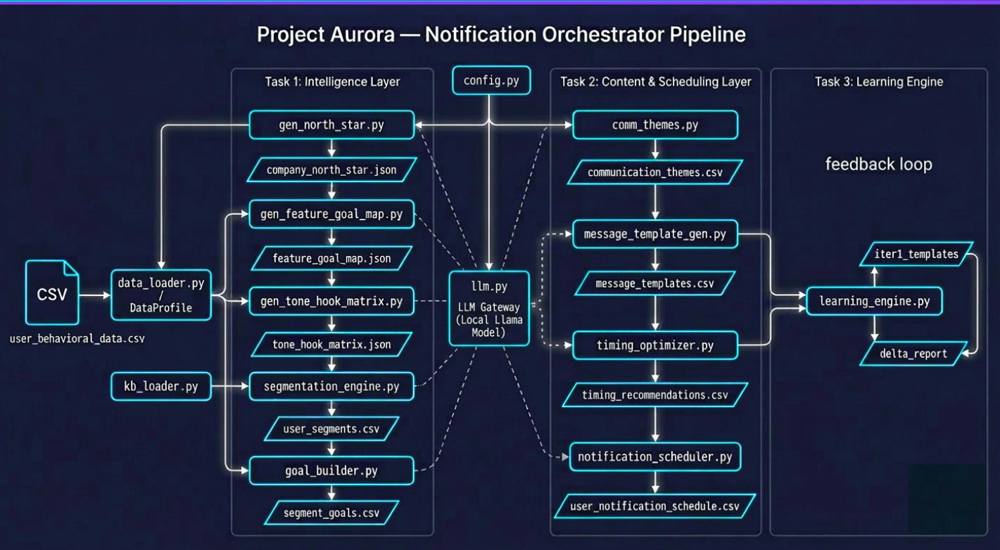
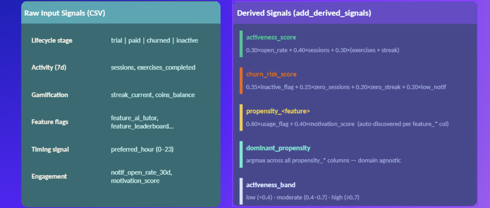
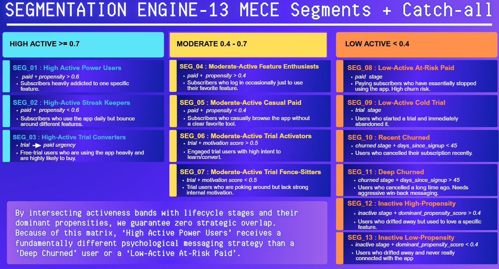

# Aurora

Project Aurora is a self-learning notification orchestration system for a language-learning app (VoiceUp).  
It combines deterministic data engineering with constrained LLM generation, then closes the loop with experiment-driven iteration.

## 1) What This Repo Demonstrates

- End-to-end ML/AI system design: from raw behavioral data to personalized schedules.
- Hybrid architecture: deterministic modules for reliability + LLM modules for adaptive content generation.
- Product-minded experimentation: campaign outputs are evaluated and mutated using real performance signals.
- Production-style engineering: modular pipeline, task-level reruns, safety fallbacks, and auditable artifacts.

## 2) Quantified Snapshot (from current repo artifacts)

| Metric | Value |
|---|---|
| Users in behavioral dataset | 61 |
| Experiment feedback rows | 76 |
| Total sends in experiment log | 492,000 |
| Lifecycle stages represented | 4 (trial, paid, churned, inactive) |
| Behavioral segments generated | 8 (MECE style) |
| Segment-goal planning rows | 24 |
| Communication theme rows | 24 |
| Message templates (iteration 0) | 135 |
| Message templates (iteration 1) | 135 |
| Timing recommendation rows | 13 per iteration |
| Notification schedule rows | 85 (iter 0), 101 (iter 1) |
| Python modules in `codebase/` | 15 |
| Approximate Python LOC | 4,365 |
| Architecture images in repo | 3 |

## 3) System Architecture Visuals




## 4) Pipeline Overview 

1. **Input profiling and feature engineering** (`data_loader.py`)
   - Cleans schema and computes derived signals like activeness, churn risk, and per-feature propensity.

   

2. **Strategy generation (Task 1)**
   - `gen_north_star.py`, `gen_feature_goal_map.py`, `gen_tone_hook_matrix.py`
   - Produces business-aware strategy artifacts grounded in the knowledge bank and data summary.
3. **Audience modeling and planning**

   - `segmentation_engine.py`, `goal_builder.py`
   - Creates user segments and segment-level lifecycle goals.

   



4. **Creative generation and delivery optimization (Task 2)**
   - `comm_themes.py`, `message_template_gen.py`, `timing_optimizer.py`, `notification_scheduler.py`
   - Outputs themes, bilingual template sets, timing windows, and daily schedules.
5. **Self-learning loop (Task 3)**
   - `learning_engine.py`
   - Reads experiment performance, classifies templates, rewrites weak performers, and regenerates iteration-1 outputs.

## 5) Learning Behavior Across Iterations

From `iteration_1_after_learning/message_templates.csv`:
- Template status distribution: **35 GOOD, 70 NEUTRAL, 30 BAD**
- All BAD templates were rewritten as lineage-tracked `_v2` variants.
- Timing windows shifted toward evening concentration:
  - Iteration 0 window mix: `early_morning:4, evening:4, night:4, mid_morning:1`
  - Iteration 1 window mix: `evening:11, early_morning:1, mid_morning:1`

### Segment-Level Message Comparison (6 segments, 2 messages each iteration)

| Segment | Iteration 0 (2 sample messages) | Iteration 1 (2 sample messages) | Learned Signal |
|---|---|---|---|
| **SEG_01** High-Active Power Users | 1) Start Today's Session - Three minutes is all it takes. Open now and keep your streak alive.<br>2) Ready to beat yesterday? - Your last score was 72. Can you top it in 5 minutes today? | 1) Boost Your Streak Today! - Complete today's session to keep your streak alive.<br>2) Ready to Beat Yesterday? - Your last score was 72. Can you top it in 5 minutes today? | GOOD |
| **SEG_04** Moderate-Active Feature Enthusiasts | 1) Start Today's Session - Three minutes is all it takes. Open now and keep your streak alive.<br>2) Ready to beat yesterday? - Your last score was 72. Can you top it in 5 minutes today? | 1) Train for Victory - Unlock exclusive premium content and exercises to boost your streak.<br>2) Build Your Streak Foundation - Unlock exclusive premium content and boost your daily practice with Sia. | NEUTRAL |
| **SEG_06** Moderate-Active Trial Activators | 1) Start Today's Session - Three minutes is all it takes. Open now and keep your streak alive.<br>2) Ready to beat yesterday? - Your last score was 72. Can you top it in 5 minutes today? | 1) My Streak Was Dead, But VoiceUp Brought Me Back to Life - Unlock daily exercises with Sia and revive your streak!<br>2) Phoenix Rises from the Ashes of Inactivity - Unlock your VoiceUp streak with daily practice sessions and AI-powered feedback. | BAD, NEUTRAL |
| **SEG_08** Low-Active At-Risk Paid | 1) Start Today's Session - Three minutes is all it takes. Open now and keep your streak alive.<br>2) Ready to beat yesterday? - Your last score was 72. Can you top it in 5 minutes today? | 1) Start Today's Session - Three minutes is all it takes. Open now and keep your streak alive.<br>2) Unlock Your Streak's Masterpiece - Boost your fluency with our AI-powered practice sessions. | NEUTRAL |
| **SEG_09** Low-Active Cold Trial | 1) Start Today's Session - Three minutes is all it takes. Open now and keep your streak alive.<br>2) Ready to beat yesterday? - Your last score was 72. Can you top it in 5 minutes today? | 1) My Streak Was Lost in the Haze of Inactivity - Daily practice with Sia's AI tutor helps you find your rhythm again.<br>2) Unlock Your Streak's Secret - Discover how VoiceUp's AI tutor helps you regain momentum with personalized feedback. | BAD |
| **SEG_11** Deep Churned | 1) Start Today's Session - Three minutes is all it takes. Open now and keep your streak alive.<br>2) Ready to beat yesterday? - Your last score was 72. Can you top it in 5 minutes today? | 1) Your 7-day streak is at risk! - Three minutes to save it. Open now and keep your streak alive.<br>2) Ready to beat yesterday? - Your last score was 72. Can you top it in 5 minutes today? | GOOD |

## 6) Why This Is Strong for ML/AI + SDE Roles

- **ML thinking:** feature engineering, segmentation logic, behavioral policy optimization, metric-driven iteration.
- **LLM systems design:** prompt-constrained JSON generation, validation/fallback safeguards, controlled generation slots.
- **Experimentation mindset:** templates tied to CTR/engagement/uninstall outcomes and evolved with explicit thresholds.
- **Software engineering quality:** modular codebase, explicit artifacts, rerunnable steps, and transparent pipeline control via CLI.

## 7) How to Run

```bash
python codebase/main.py
python codebase/main.py --steps task1
python codebase/main.py --steps task2
python codebase/main.py --steps task3
python codebase/main.py --list
```

Dependencies and local model settings are configured in `codebase/config.py` (default generation model: `llama3.2:3b` via Ollama).
